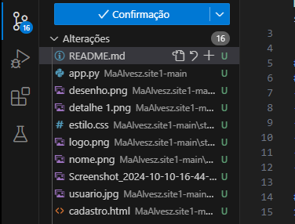

# App Harmony
Neste repositório está implementado o sistema Harmony, um site para ouvir musica como um spotfy da vida.

## Como instalar o sistema 
### Requisitos
- Computador
- Internet
- Visual Studio Code 
- Python
- Biblioteca flask para Python
- Extenção Python do VS Code

#### Clonar repositório do Github
1. Primeiro, clique no botão "controle de código de fonte"

2. Clique em "Clonar repositório", "clonar 